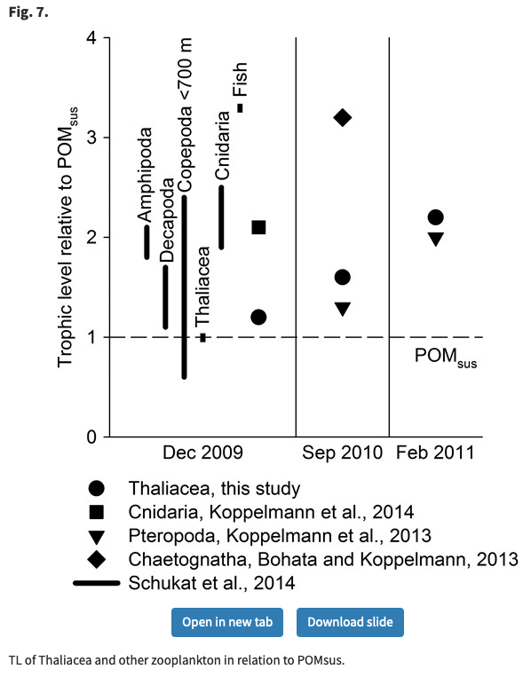

# TODOs

- spatial & temportal autocorrelation

- set a seed for reproducibility

- label chunks

- save models / predictions

- give better names to plankton morphological metrics

# Importance of this work

We can predict plankton diversity from environmental variables. 

A few plankton diversity metrics can explain XX% of POC variance.

Current biogeochemical models use PFTs = fixed boxes of plankton. These boxes should not be fixed neither in time nor in space.
Other approach: identify plankton metrics that are relevant for the carbon cycle (e.g. based on POC export at 1000~m) using ML.
These plankton metrics could then be implemented into bgc models, i.e. instead of XX boxes of plankton we could have only one type of plankton with varying properties in time and space. These properties can be learned from the environment using ML. 

# Morphological diversity metrics

# Trophic levels

Historically, the notion of assigning trophic levels in ecology passed through two stages.
During the first phase, initiated by Charles Elton of the University of Oxford and Raymond Lindeman of Yale University,
trophic levels were seen as pre-defined categories into which organisms could be pigeonholed - perhaps shoehorned is the better metaphor,
given that complex feeding habits could not readily be accounted for. Fish that normally consume zooplankton were assigned a trophic level of three,
because zooplankton (with a trophic level of two) normally consume phytoplankton (trophic level of one).
This procedure ignores the fact that some zooplankton are carnivorous and thus should be assigned a trophic level somewhat higher than two,
which implies that their predators should in turn be placed at trophic levels above three.
Hierarchy of food items, simplified from the FishBase table used to compute trophic levels (TL) from diet composition data. Therein, the TL of a consumer is 1 + (mean TL of the prey items).

http://www.seafriends.org.nz/issues/fishing/pauly0.htm

--- 

Martin 2017: https://academic.oup.com/plankt/article/39/2/290/2758648

Stable isotope analyses suggest a higher trophic level for Thaliacea than for herbivorous copepods.

δ15N values of suspended particulate organic matter (POMsus), which was concomitantly sampled, were used as a baseline for trophic level (TL) calculations (see Koppelmann et al., 2013, 2014).

--- 

Koppelmann 2014: https://www.cambridge.org/core/journals/journal-of-the-marine-biological-association-of-the-united-kingdom/article/onshoreoffshore-distribution-of-thecosomata-gastropoda-in-the-benguela-current-upwelling-region-off-namibia-species-diversity-and-trophic-position/9231CA48082E65EFFCC11D50AFDE45F4

---

Bode 2015: https://www.sciencedirect.com/science/article/pii/S0079661115002116

Trophic level of various copepods.

--- 

Protopapa 2019: https://www.sciencedirect.com/science/article/pii/S0967064519300311

--- 

Denda 2017: https://www.sciencedirect.com/science/article/pii/S096706371630440X

Feeding type of many planktonic organisms.

---

Choi 2020: https://www.frontiersin.org/articles/10.3389/fmars.2020.00489/full

Trophic position of several planktonic orgasisms.

---

Basedow 2016: https://academic.oup.com/plankt/article/38/6/1364/2528009

Trophic position of several planktonic orgasisms.

---

Giering 2019: https://www.sciencedirect.com/science/article/pii/S0079661118300399

Trophic position for whole plankton community. 

---

Costalago 2020: https://www.ncbi.nlm.nih.gov/pmc/articles/PMC7244518/#MOESM1

A few planktonic TLs in supp. 

---

Landry 2017: https://academic.oup.com/icesjms/article/74/7/1885/2977679

A few planktonic TLs.

---

Hannides 2009: https://aslopubs.onlinelibrary.wiley.com/doi/abs/10.4319/lo.2009.54.1.0050

A few planktonic TLs.

--- 

Richoux 2009: https://academic.oup.com/plankt/article/31/9/1059/1399146?login=true

Several planktonic TLs.

---

Bode 2006: https://www.sciencedirect.com/science/article/pii/S1569486005080228#tblfn002

Values for herbivorous and carnivorous zooplankton.

--- 

